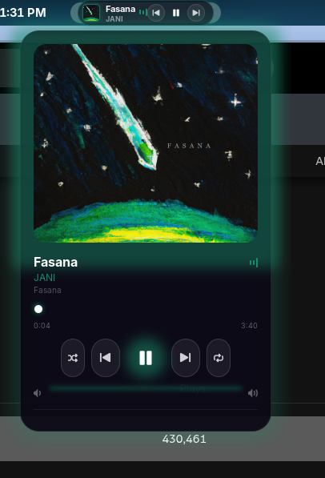
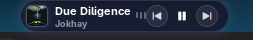
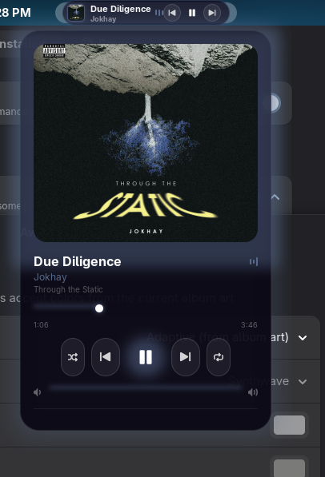
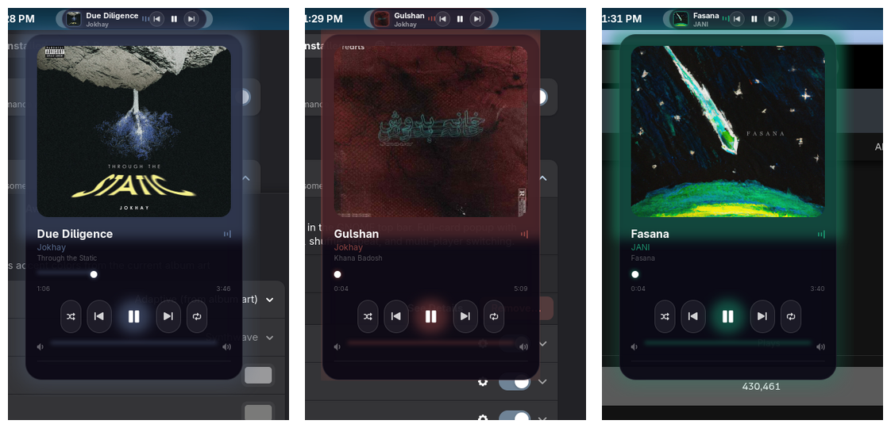

# Awesome Media Controller

> Frosted-neon-glass media controls for the GNOME top bar — album art, a full-card popup, animated EQ bars, a breathing glow, and six built-in themes.

[](LICENSE)

[](https://github.com/Safwan2003/awesome-media-controller/actions/workflows/ci.yml)

<!-- TODO: replace with a real hero GIF of the pill + popup in action -->
<p align="center">
  
</p>

A polished [MPRIS](https://specifications.freedesktop.org/mpris-spec/latest/) media controller. It shows the currently playing track as a frosted-glass pill in the panel and opens into a full glass card with album art, a glowing scrub bar, volume, shuffle/repeat, and a multi-player switcher — styled with layered neon glow and your choice of six preset themes (or colors pulled live from the album art).

---

## Features

- 🎵 **MPRIS-native** — works with Spotify, Firefox/Chromium, VLC, Rhythmbox, and any MPRIS2 player
- 🪟 **Frosted-glass UI** — layered faux-glass surfaces with neon accent glows (pure St CSS, no compositor blur required)
- 🎨 **Six built-in themes** — Synthwave, Cyberpunk, Aurora, Sunset Lo-fi, Toxic, Crimson
- 🖼️ **Adaptive colors** — optionally extract the accent palette from the current album art
- 📊 **Animated EQ bars** + a slow breathing glow pulse while playing
- ⏯️ **Full popup card** — album art halo, glowing progress bar with a scrub knob, volume, shuffle, repeat
- 🔀 **Multi-player switcher** — jump between active players with per-app color dots
- ✨ **Eased popup entrance** + tactile button press feedback
- ⚙️ **Preferences** — pick theme mode/preset, panel position, marquee titles, and toggle animations

## Screenshots

<!-- TODO: add real images to docs/screenshots/ and update these -->
| Glass pill (panel) | Full popup card | Theme presets |
|---|---|---|
|  |  |  |

## Install

### From extensions.gnome.org (recommended)

<!-- TODO: add the EGO link once published -->
Search for **“Awesome Media Controller”** on [extensions.gnome.org](https://extensions.gnome.org/) and toggle it on, or install the *Extension Manager* app and search there.

### Manual (from source)

Requires **GNOME Shell 50**.

```bash
git clone https://github.com/Safwan2003/awesome-media-controller.git
cd awesome-media-controller
./install.sh
```

Then log out and back in (GNOME caches extension modules within a session), and enable it:

```bash
gnome-extensions enable awesome-media-controller@awesome
```

Open settings with:

```bash
gnome-extensions prefs awesome-media-controller@awesome
```

## Configuration

| Setting | What it does |
|---|---|
| **Accent colors** | `Adaptive` (from album art), `Preset theme`, or `Custom` gradient |
| **Preset theme** | One of the six built-ins (used in Preset mode) |
| **Panel position** | Left / Center / Right of the top bar |
| **Playback buttons in pill** | Show prev/play/next directly in the panel |
| **Marquee titles** | Scroll long track titles in the pill |
| **Animations** | EQ bars, glow pulse, and popup transitions |

## Compatibility

Verified on **GNOME Shell 50**. Other versions are not currently tested — if you run a different version and it works (or doesn't), please [open an issue](https://github.com/Safwan2003/awesome-media-controller/issues) so the supported list can be expanded honestly.

## Development

```bash
# Unit tests (theme/palette logic — runs in plain gjs)
gjs -m tests/test-theme.js

# Validate the GSettings schema
glib-compile-schemas --strict --dry-run schemas/
```

> ⚠️ A live Wayland session caches extension modules — code changes won't show up until you log out/in. For integration testing use a nested/headless `gnome-shell` (see `docs/`).

See [CONTRIBUTING.md](CONTRIBUTING.md) for the full workflow and architecture notes.

## Contributing

Issues and PRs are welcome — bug reports, new preset themes, and version-compatibility fixes especially. Please read [CONTRIBUTING.md](CONTRIBUTING.md) first.

## Support

If this extension brightens your panel, consider sponsoring continued maintenance:

<!-- TODO: replace with your real sponsor links -->
- ❤️ [GitHub Sponsors](https://github.com/sponsors/Safwan2003)
- ☕ [Ko-fi](https://ko-fi.com/Safwan2003)

## License

[GPL-3.0-or-later](LICENSE) © Awesome Media Controller contributors.

GNOME Shell extensions link against GPL-licensed Shell internals, so this project is GPL by design — you're free to use, study, share, and modify it.
